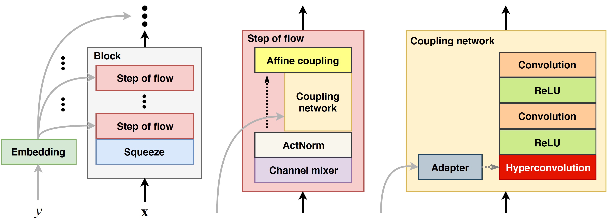

# Blow Conversions

This is the demonstration page of the paper "Blow: a single-scale hyperconditioned flow for non-parallel raw-audio voice conversion", where we show some audio conversion examples.

## Info

### Abstract

End-to-end models for raw audio generation are a challenge, specially if they have to work with non-parallel data, which is a desirable setup in many situations. Voice conversion, in which a model has to impersonate a speaker in a recording, is one of those situations. In this paper, we propose Blow, a single-scale normalizing flow using hypernetwork conditioning to perform many-to-many voice conversion between raw audio. Blow is trained end-to-end, with non-parallel data, on a frame-by-frame basis using a single speaker identifier. We show that Blow compares favorably to existing flow-based architectures and other competitive baselines, obtaining equal or better performance in both objective and subjective evaluations. We further assess the impact of its main components with an ablation study, and quantify a number of properties such as the necessary amount of training data or the preference for source or target speakers.

### Reference

J. Serrà, S. Pascual, & C. Segura (2019). **Blow: a single-scale hyperconditioned flow for non-parallel raw-audio voice conversion**. In _Advances in Neural Information Processing Systems (NeurIPS)_. In press.

Paper: <https://arxiv.org/abs/1906.00794>

Code: <https://github.com/joansj/blow>

## Examples

### Example 1

Source:
<html>
  <audio controls>
    <source src="p361_01198.wav">
  </audio>
</html>

Target:
<html>
  <audio controls>
    <source src="p245_05025.wav">
  </audio>
</html>

Conversion:
<html>
  <audio controls>
    <source src="p361_01198_to_p245.wav">
  </audio>
</html>

### Example 2

Source:
<html>
  <audio controls>
    <source src="p278_04851.wav">
  </audio>
</html>

Target:
<html>
  <audio controls>
    <source src="p287_11336.wav">
  </audio>
</html>

Conversion:
<html>
  <audio controls>
    <source src="p278_04851_to_p287.wav">
  </audio>
</html>

### Example 3

Source:
<html>
  <audio controls>
    <source src="p302_01863.wav">
  </audio>
</html>

Target:
<html>
  <audio controls>
    <source src="p298_00585.wav">
  </audio>
</html>

Conversion:
<html>
  <audio controls>
    <source src="p302_01863_to_p298.wav">
  </audio>
</html>

### Example 4

Source:
<html>
  <audio controls>
    <source src="p361_00375.wav">
  </audio>
</html>

Target:
<html>
  <audio controls>
    <source src="p345_07944.wav">
  </audio>
</html>

Conversion:
<html>
  <audio controls>
    <source src="p361_00375_to_p345.wav">
  </audio>
</html>

### Example 5

Source:
<html>
  <audio controls>
    <source src="p260_01623.wav">
  </audio>
</html>

Target:
<html>
  <audio controls>
    <source src="p267_03956.wav">
  </audio>
</html>

Conversion:
<html>
  <audio controls>
    <source src="p260_01623_to_p267.wav">
  </audio>
</html>

### Example 6

Source:
<html>
  <audio controls>
    <source src="p273_04605.wav">
  </audio>
</html>

Target:
<html>
  <audio controls>
    <source src="p351_00081.wav">
  </audio>
</html>

Conversion:
<html>
  <audio controls>
    <source src="p273_04605_to_p351.wav">
  </audio>
</html>

### Example 7

Source:
<html>
  <audio controls>
    <source src="p245_05208.wav">
  </audio>
</html>

Target:
<html>
  <audio controls>
    <source src="p273_04707.wav">
  </audio>
</html>

Conversion:
<html>
  <audio controls>
    <source src="p245_05208_to_p273.wav">
  </audio>
</html>

### Example 8

Source:
<html>
  <audio controls>
    <source src="p304_00078.wav">
  </audio>
</html>

Target:
<html>
  <audio controls>
    <source src="p238_02097.wav">
  </audio>
</html>

Conversion:
<html>
  <audio controls>
    <source src="p304_00078_to_p238.wav">
  </audio>
</html>

### Example 9

Source:
<html>
  <audio controls>
    <source src="p297_06758.wav">
  </audio>
</html>

Target:
<html>
  <audio controls>
    <source src="p283_02612.wav">
  </audio>
</html>

Conversion:
<html>
  <audio controls>
    <source src="p297_06758_to_p283.wav">
  </audio>
</html>

### Example 10

Source:
<html>
  <audio controls>
    <source src="p246_00375.wav">
  </audio>
</html>

Target:
<html>
  <audio controls>
    <source src="p362_09911.wav">
  </audio>
</html>

Conversion:
<html>
  <audio controls>
    <source src="p246_00375_to_p362.wav">
  </audio>
</html>

---

_Last update: May 2019_
